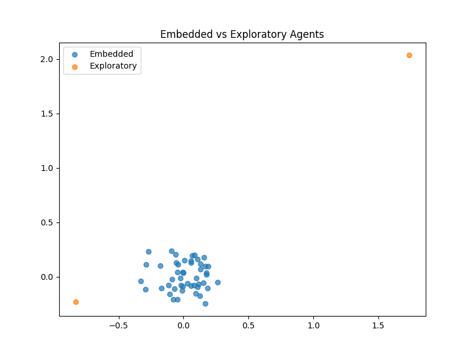

# Exploration Dynamics in Agent-Based Systems

This repository explores minimal exploration dynamics in agent-based systems, focusing on the difference between random-walk exploration and locally constrained motion.

---

## Motivation

In many models, exploration is associated with optimization, adaptive behavior, or goal-directed search.  
This project investigates whether non-trivial spatial and dynamical structure can emerge from minimal stochastic movement alone.

The repository studies how simple mobility heterogeneity generates differences in spatial organization without requiring learning, planning, or intelligent behavior.

---

## Model

We consider two types of agents evolving in a two-dimensional continuous space.

### Embedded Agents
- Locally constrained motion
- Weak attraction toward a central region
- Low-entropy trajectories

### Exploratory Agents
- Random-walk dynamics
- Diffusive trajectories
- Higher spatial dispersion

The simulations compare:
- Random walk vs constrained movement
- Spatial coverage
- Entropy of visited regions
- Transition frequency

---

## Metrics

The following observables are computed:

- **Coverage** — spatial extent explored by the population
- **Entropy of positions** — diversity of visited spatial configurations
- **Switching rate** — frequency of movement across regions

These metrics provide a minimal quantitative description of exploration dynamics in structured environments.

---

## Installation

Install dependencies:

```bash
pip install -r requirements.txt
```

---

## Run the Simulation

Generate simulation data:

```bash
python scripts/run_simulation.py
```

Analyze results and generate figures:

```bash
python scripts/analyze.py
```

---

## Relation to Main Research Project

These experiments are part of a broader research program on emergent connectivity in structured agent-based systems.

Related work:

**From Boundary Crossings to Global Connectivity:  
A Minimal Mechanism in Structured Agent-Based Landscapes (2026)**

This repository specifically supports the idea that:

> complex system-level organization can emerge from simple stochastic exploration without optimization or goal-directed behavior.

---

## Example Output

Final spatial configuration of embedded and exploratory agents:



---

## References

1. Codling, E. A., Plank, M. J., & Benhamou, S. (2008).  
   *Random walk models in biology*.  
   Journal of the Royal Society Interface, 5(25), 813–834.

2. March, J. G. (1991).  
   *Exploration and exploitation in organizational learning*.  
   Organization Science, 2(1), 71–87.

3. Bonabeau, E. (2002).  
   *Agent-Based Modeling: Methods and Techniques for Simulating Human Systems*.  
   Proceedings of the National Academy of Sciences, 99, 7280–7287.

4. Holland, J. H. (1998).  
   *Emergence: From Chaos to Order*.  
   Oxford University Press.

5. Mitchell, M. (2009).  
   *Complexity: A Guided Tour*.  
   Oxford University Press.

---

## Topics

- Complex Systems
- Agent-Based Modeling
- Exploration Dynamics
- Random Walks
- Emergence
- Network Science
- Stochastic Systems

---

## Author

**Meccanismo Complesso**  
Independent research project on complex systems, emergence, and agent-based dynamics.

